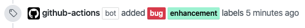

# Action Add Labels



This is a GitHub Action to add GitHub label to an issue or a pull request.

It would be more useful to use this with other GitHub Actions' outputs.

## Inputs

|      Key       | Required |             Default              |                                  Note                                  |
| -------------- | -------- | -------------------------------- | ---------------------------------------------------------------------- |
| `github_token` | `true`   | N/A                              | Must be in form of `github_token: ${{ secrets.github_token }}`.        |
| `labels`       | `true`   | N/A                              | Must be in form of JSON array. e.g. `'["documentation", "changelog"]'` |
| `owner`        | `false`  | `${{ github.repository_owner }}` |                                                                        |
| `repo`         | `false`  | `${{ github.repository }}`       |                                                                        |
| `dry_run`      | `false`  | `false`                          |                                                                        |

## Example

```yaml
name: Add Label

on:
  pull_request:
    types: opened

jobs:
  size:
    runs-on: ubuntu-latest
    steps:
      - uses: actions/checkout@v2
      - uses: actions-ecosystem/action-add-labels@v1
        with:
          github_token: ${{ secrets.github_token }}
          label: '["enhancement"]'
```

## License

Copyright 2020 The Actions Ecosystem Authors.

Action Size is released under the [Apache License 2.0](./LICENSE).
